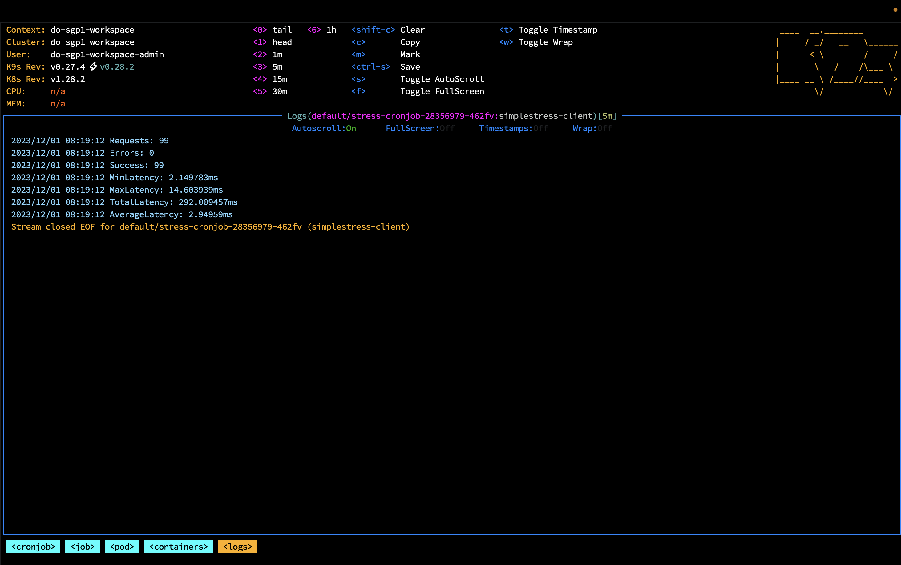

# Simple Stress Tool

It's a simple self gRPC stress testing tool.
You can deploy the client and server on your own Kubernetes cluster to test.
It will set a Kubernetes cronjob to perform stress tests (once every 5 minutes).

## Run a simple ping pong GRPC Server

```bash
go run server/main.go
```

or 

```bash
./server/server
```

## Run Client to stress test

```bash
go run client/main.go {...arguments}
```

or 
```bash
./client/client {...arguments}
```

Heer's argument usages

```
  -addr string
        the address to connect to (default "localhost:50051")
  -concurrent int
        the number of concurrent requests (default 2)
  -frequency int
        the frequency of requests per second (default 1)
```

## Build

You can run make to build client and server command

```bash
    make
```

## Build Docker

You can build server/client Docker images using make

```bash
    make build-client-docker
    make build-server-docker
```

## Deploy to kubernetes

Before deploy to k8s, you need to configure you k8s credentials first.
Then use ```make deploy``` to deploy

```bash
    make deploy
```

## Configure Frequency and Concurrent by k8s yaml

You can update fields in deployments/k8s/client.yaml to change frequency and concurrent

Here's the fields

```
spec.JobTemplate.spec.template.containers[].args
```

## Read the Metrics results

It's only support k8s logs now.
I recommand you use k9s to read the cronjob result.




