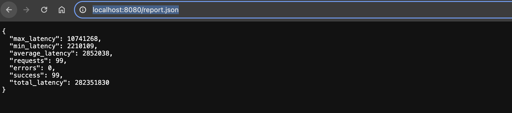
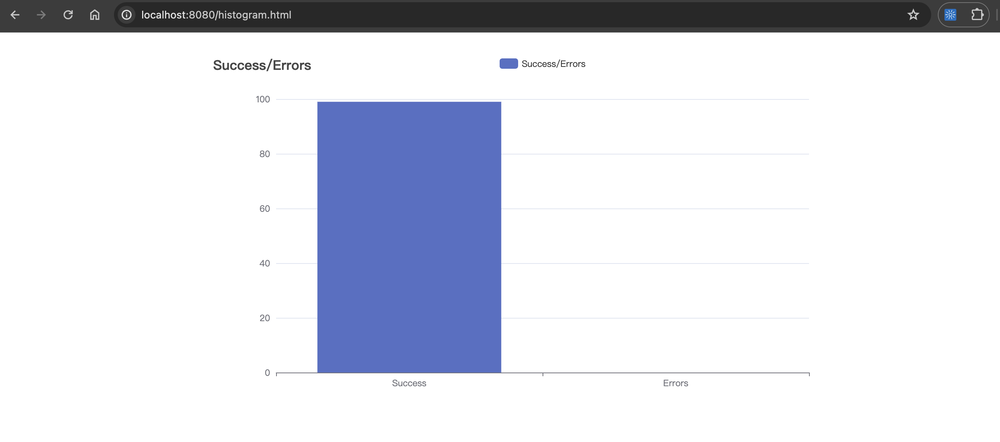

# Simple Stress Tool

It's a simple self gRPC stress testing tool.
You can deploy the client and server on your own Kubernetes cluster to test.
It will set a Kubernetes cronjob to perform stress tests (once every 5 minutes).

## Run a simple ping pong GRPC Server

```bash
go run server/main.go
```

or 

```bash
./server/server
```

## Run Client to stress test

```bash
go run client/main.go {...arguments}
```

or 
```bash
./client/client {...arguments}
```

Heer's argument usages

```
  -addr string
        the address to connect to (default "localhost:50051")
  -concurrent int
        the number of concurrent requests (default 2)
  -frequency int
        the frequency of requests per second (default 1)
  -histogram-path string
        the path to the historgram file (default "histogram.html")
  -report-path string
        the path to the report file (default "report.json")
  -runtime int
        the number of seconds to run (default 10)
```

## Build

You can run make to build client and server command

```bash
    make
```

## Build Docker

You can build server/client Docker images using make

```bash
    make build-client-docker
    make build-server-docker
```

## Deploy to kubernetes

Before deploy to k8s, you need to configure you k8s credentials first.
If you are not using DigitalOcean Volume on Kubernetes, please replace your PersistentVolumeClaim at deployments/k8s/report.yaml

Then use `make deploy` to deploy

```bash
    make deploy
```

## Configure Frequency and Concurrent by k8s yaml

You can update fields in deployments/k8s/client.yaml to change frequency and concurrent

Here's the fields

```
spec.JobTemplate.spec.template.containers[].args
```

## Read the Metrics results

It will serve report service on report-service:80, your can use port-forward to see the latest report json

Use forward command below will show report json/histogram on your `http://localhost:8080/report.json` and `http://localhost:8080/histogram.html`

```bash
kubectl port-forward service/report-service 8080:80
```





If you don't want to forward report-service, I recommand you use k9s to read the cronjob result.


